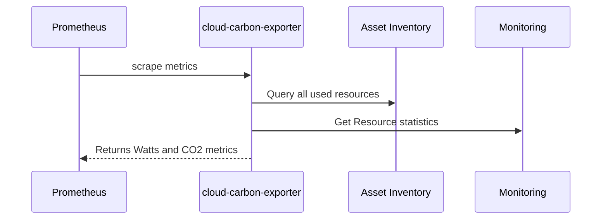
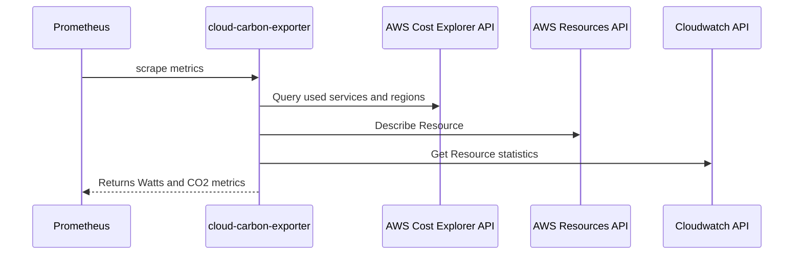
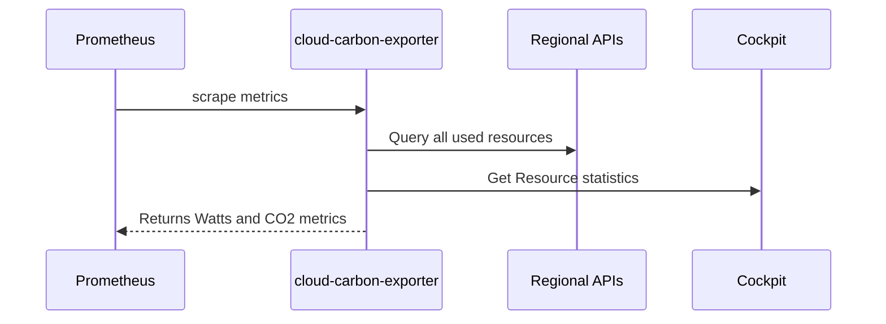

# Cloud Carbon Exporter


This exporter discovers all the resources of your cloud project and estimates the associated energy and carbon emissions in real time. Installing this service will enable your operational and development teams to follow the [Carbon-Driven Development](https://dangofish.com/carbon-driven-development) principles.

## Carbon-Driven Development

The Carbon-Driven Development (CDD) philosophy is based on three main principles:

1. Estimate the **energy** consumed by each resource (servers, load balancers, buckets, etc.).
2. Aggregate this data in **real time**
3. In a **production** environment

By applying these few rules, production teams will be able to :

1. Globally measure a **system's effectiveness** in relation to the business
2. Engage other team members in production activities and **continuous improvement**
3. Detect infrastructure anomalies **faster**
4. Reduce the **carbon footprint** of applications

[Check out the original article](https://dangofish.com/carbon-driven-development) which explains in detail the concepts of CDD.


### Demo


On this demo you can visualize and understand the estimated energy consumed by connected user, the current CO2 emissions and the equivalent in turned on lightbulbs.

You can try this demo on the Grafana dashboard :
<a href="https://demo.carbondriven.dev/public-dashboards/04a3c6d5961c4463b91a3333d488e584" target="_blank">https://demo.carbondriven.dev</a>

## How it works

**Multi Cloud** · We want to support as much cloud platform as possible. From hyperscalers to edge datacenters to regional provider. For now we support: AWS, GCP, Scaleway

**Multi Model** · The exporter is designed to be model agnostic. We plan to support and contribute back to:

- https://www.cloudcarbonfootprint.org/
- https://boavizta.org/en
- Other experimentations

This tool will prioritize the number of supported resources over the precision of the exported metrics. Estimating precisely the energy consumption of a resource is a hard task. The complexity and opacity of a Cloud service increase the margin of error but trends should be respected.

Once the resource energy draw is estimated, the exporter evaluates the carbon intensity of the resource at its location based on [publicly available datasets.](https://github.com/GoogleCloudPlatform/region-carbon-info)

**OpenMetrics** · The exporter is compatible [OpenMetrics](https://prometheus.io/docs/specs/om/open_metrics_spec/) format. Therefore, you can ingest metrics into Prometheus, Datadog and every time series database that support this standard.

**Performance** · We're paying close attention to the exporter performance. Most API requests are done concurrently and cached. Most scrapes finish under 1000ms even with thousand monitored resources.


## Install

You can download the official Docker Image on the [Github Package Registry](https://github.com/superdango/cloud-carbon-exporter/pkgs/container/cloud-carbon-exporter)

```
$ docker pull ghcr.io/superdango/cloud-carbon-exporter:latest
```

## Configuration

The Cloud Carbon Exporter can work on Google Cloud Platform, Amazon Web Service and Scaleway (more to come).

### Google Cloud Platform



The exporter uses GCP Application Default Credentials:

- `GOOGLE_APPLICATION_CREDENTIALS` environment variable
- `gcloud auth application-default` login command
- The attached service account, returned by the metadata server (inside GCP environment)

```
$ docker run -p 2922 ghcr.io/superdango/cloud-carbon-exporter:latest \
        -cloud.provider=gcp \
        -gcp.projectid=myproject
```

### Amazon Web Services



The exporter is :

- Environment Variables (`AWS_SECRET_ACCESS_KEY`, `AWS_ACCESS_KEY_ID`, `AWS_SESSION_TOKEN`)
- Shared Configuration
- Shared Credentials files.

```
$ docker run -p 2922 ghcr.io/superdango/cloud-carbon-exporter:latest \
        -cloud.provider=aws
```

### Scaleway



Configure the exporter via:

- Environment Variables (`SCW_ACCESS_KEY`, `SCW_SECRET_KEY`)

```
$ docker run -p 2922 ghcr.io/superdango/cloud-carbon-exporter:latest \
        -cloud.provider=scw
```

### Deployment

Cloud Carbon Exporter can easily run on serverless platform like GCP Cloud Run or AWS Lambda for testing purpose. However, we do recommend keeping the exporter alive as long as possible

### Usage

```
Usage of ./cloud-carbon-exporter:
  -cloud.aws.defaultregion string
        aws default region (default "us-east-1")
  -cloud.aws.rolearn string
        aws role arn to assume
  -cloud.gcp.projectid string
        gcp project to explore resources from
  -cloud.provider string
        cloud provider type (gcp, aws, scw)
  -demo.enabled string
        return fictive demo data (default "false")
  -listen string
        addr to listen to (default "0.0.0.0:2922")
  -log.format string
        log format (text, json) (default "text")
  -log.level string
        log severity (debug, info, warn, error) (default "info")

Environment Variables:
  SCW_ACCESS_KEY
        scaleway access key
  SCW_SECRET_KEY
        scaleway secret key
```

## Additional Cloud Cost

Calls to cloud monitoring APIs can incur additional costs. The exporter will do its best to cache API
responses and therefore, lower the impact on your bill. API costs are directly correlated to the number of
resources the exporter generate data from. Here are the average costs you may observe per resource on your cloud account
or project (instance, bucket, load balancer) for a 15 minutes cache TTL:

- AWS: $0,20 per resource
- GCP: $0,09 per resource (will be 10 times less in October 2025)
- SCW: free

You can use the [cost calculator file](docs/cloud-carbon-exporter-costs-estimation.xlsx) to do finer estimations with your own inputs.
In this file, you can also anticipate the storage cost of carbon metrics if you choose to use the cloud provider monitoring service.

## Development

    go build \
        -o exporter \
        github.com/superdango/cloud-carbon-exporter/cmd && \
        ./exporter -cloud.provider=aws -log.level=debug

## Acknowledgements

Many of the most valuable contributions are in the forms of testing, feedback, and documentation. These help harden software and streamline usage for other users.

We want to give special thanks to individuals who invest much of their time and energy into the project to help make it better:

- Thanks to [Hakim Rouatbi](https://github.com/hakro), [Raphaël Cosperec](https://github.com/rcosperec) and [Souhail Hanfi](https://github.com/hanfi/) for giving early feedbacks.

## Sponsor

[dangofish.com](dangofish.com) - Tools and Services for Carbon Driven Developers.

## Licence

This software is provided as is, without waranty under [AGPL 3.0 licence](https://www.gnu.org/licenses/agpl-3.0.en.html)