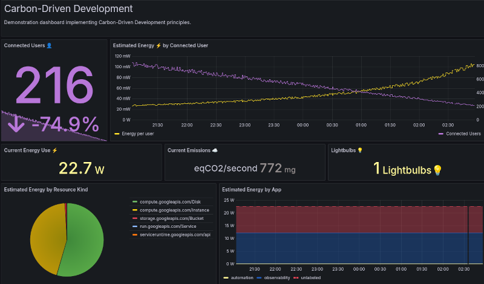
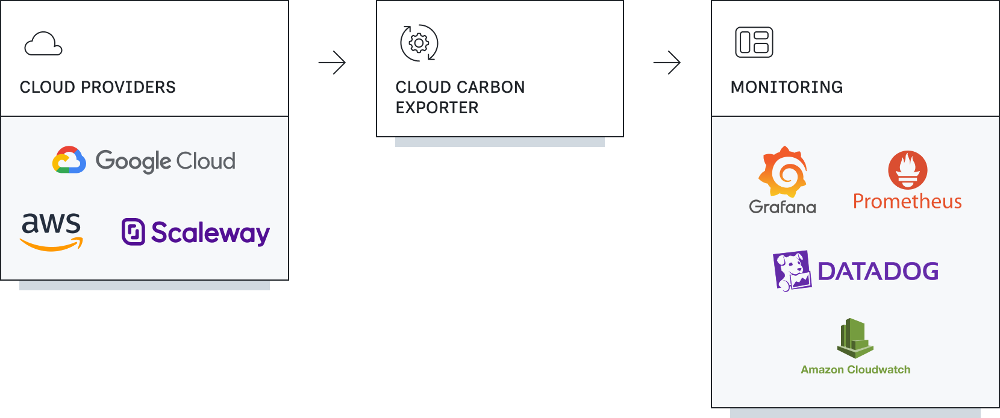
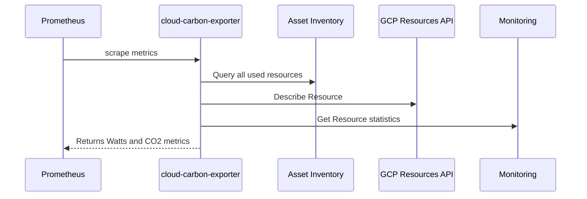
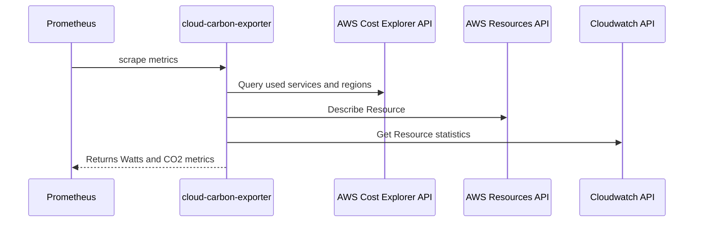
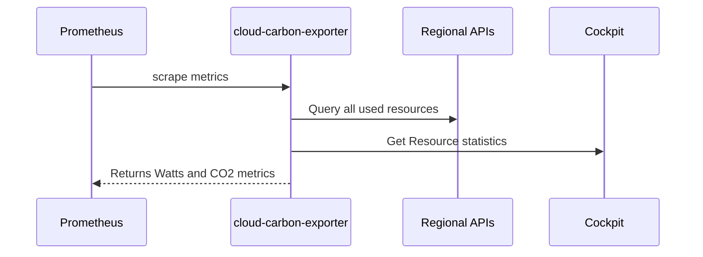

# Cloud Carbon Exporter

Monitor your cloud's carbon footprint in real-time


Cloud Carbon Exporter automatically discovers cloud resources, estimates energy consumption and carbon emissions in real-time. This tool provides valuable insights for operational and tech teams interested in following the [Carbon-Driven Development](https://dangofish.com/carbon-driven-development) principles.

## Carbon-Driven Development

Carbon-Driven Development (CDD) is a philosophy to build digital services and manage cloud infrastructure with environmental sustainability at its core.

It revolves around three pillars:

1. **Estimate energy consumption** for each cloud resource (servers, load balancers, storage, etc.)
2. Collect data in **production environments**
3. Aggregate data in **real-time**

By applying these few rules, production teams will be able to:

1. Measure the overall energy efficiency of a system in relation to a business use (active user, transaction, etc.).
2. Detect infrastructure anomalies **faster**
3. Engage the company's operational teams and Execs more widely in **continuous improvement**
4. Reduce the **carbon footprint** of applications

[Check out the original article](https://www.dangofish.com/toward-carbon-driven-development/) which explains in detail the concepts of CDD.

### Demo



On the screenshot above, you can visualize and understand easily:

- the estimated energy consumed by connected user to the online service,
- the current CO2 emissions,
- the equivalent in turned on lightbulbs.

You can easily customize the content of this dashboard using the data returned by the exporter.

Try our live demo with our Grafana dashboard: [https://snapshots.raintank.io](https://snapshots.raintank.io/dashboard/snapshot/xbU6hGRemC8oNoO7GWNPqpYPg0ZvDwQP)

## Technical Overview

<picture>
  <source media="(prefers-color-scheme: dark)" srcset="./docs/schema-dark.png">
  
</picture>

**Multi Cloud** · We want to support as much cloud platforms as possible. From hyperscalers to edge datacenters to regional provider. [List of supported services](https://github.com/superdango/cloud-carbon-exporter/wiki/Supported-Services)

**Dangofish Model** · This tool will prioritize the number of supported resources over the precision of the exported metrics. Estimating precisely the energy consumption of a resource is a hard task. The complexity and opacity of a Cloud service increase the margin of error but trends should be respected. Model calculations are based on public data - mixed with our own hypothesis documented in [primitives model](https://github.com/superdango/cloud-carbon-exporter/blob/main/model/primitives/README.md) and [cloud model](https://github.com/superdango/cloud-carbon-exporter/blob/main/model/cloud/README.md)

Once the resource energy draw is estimated, the exporter evaluates the carbon intensity of the resource at its location based on [publicly available datasets.](https://github.com/GoogleCloudPlatform/region-carbon-info)

**OpenMetrics** · The exporter is compatible [OpenMetrics](https://prometheus.io/docs/specs/om/open_metrics_spec/) format. Therefore, you can ingest metrics into Prometheus, Datadog and every time series database that support this standard.

**Performance** · We're paying close attention to the exporter performance. Most API requests are done concurrently and cached. Most scrapes finish under 1000ms even with thousand monitored resources.

## Install

You can download the official Docker Image on the [Github Package Registry](https://github.com/superdango/cloud-carbon-exporter/pkgs/container/cloud-carbon-exporter)

```
$ docker pull ghcr.io/superdango/cloud-carbon-exporter:latest
```

## Configuration

The Cloud Carbon Exporter can work on Google Cloud Platform, Amazon Web Service and Scaleway (more to come).

### Google Cloud Platform



The exporter uses GCP Application Default Credentials:

- `GOOGLE_APPLICATION_CREDENTIALS` environment variable
- `gcloud auth application-default` login command
- The attached service account, returned by the metadata server (inside GCP environment)

```
$ docker run -p 2922 ghcr.io/superdango/cloud-carbon-exporter:latest \
        -cloud.provider=gcp \
        -cloud.gcp.projectid=myproject
```

### Amazon Web Services



The exporter is:

- Environment Variables (`AWS_SECRET_ACCESS_KEY`, `AWS_ACCESS_KEY_ID`, `AWS_SESSION_TOKEN`)
- Shared Configuration
- Shared Credentials files.

```
$ docker run -p 2922 ghcr.io/superdango/cloud-carbon-exporter:latest \
        -cloud.provider=aws
```

### Scaleway



Configure the exporter via:

- Environment Variables (`SCW_ACCESS_KEY`, `SCW_SECRET_KEY`)

```
$ docker run -p 2922 ghcr.io/superdango/cloud-carbon-exporter:latest \
        -cloud.provider=scw
```

### Deployment

Cloud Carbon Exporter can easily run on serverless platform like GCP Cloud Run or AWS Lambda for testing purpose. However, we do recommend running the exporter as a long lived process to keep its cache in memory ([lowering the cost](#additional-cloud-cost))

### Usage

```
Usage of ./cloud-carbon-exporter:
  -cloud.aws.defaultregion string
        aws default region (default "us-east-1")
  -cloud.aws.rolearn string
        aws role arn to assume
  -cloud.gcp.projectid string
        gcp project to explore resources from
  -cloud.provider string
        cloud provider type (gcp, aws, scw)
  -demo.enabled string
        return fictive demo data (default "false")
  -listen string
        addr to listen to (default "0.0.0.0:2922")
  -log.format string
        log format (text, json) (default "text")
  -log.level string
        log severity (debug, info, warn, error) (default "info")

Environment Variables:
  SCW_ACCESS_KEY
        scaleway access key
  SCW_SECRET_KEY
        scaleway secret key
```

## Additional Cloud Cost

Calls to cloud monitoring APIs can incur additional costs. The exporter will do its best to cache API
responses and therefore, lower the impact on your bill. API costs are directly correlated to the number of
resources the exporter generate data from. Here are the average costs you may observe per resource on your cloud account
or project (instance, bucket, load balancer) for a 15 minutes cache TTL:

- AWS: $0,06 / month per resource
- GCP: $0,03 / month per resource (will be 10 times less in October 2025)
- SCW: free

_The prices shown below are dated March 2025 and are subject to change by the cloud providers._

You can use the [Cost Calculator file](https://github.com/superdango/cloud-carbon-exporter/raw/refs/heads/main/docs/cloud-carbon-exporter-costs-estimation.xlsx) to do finer estimations with your own inputs.
In this file, you can also anticipate the storage cost of carbon metrics if you choose to use the cloud provider monitoring service.

## Permissions & Security

The exporter requires permissions to automatically discover resources in your cloud environment. For a quick and easy setup, you can grant it read-only access to your entire cloud platform, such as the `Project Viewer` role or `ViewOnlyAccess` policy.

If you'd prefer a more precise approach, you can authorize only the specific API calls needed for the services you use. A detailed list of required permissions for each cloud provider service will be available soon.

If the exporter encounters a missing permission, it will log a warning with details about the issue and increment the `error_count{action="collect"}` value. We recommend periodically monitoring this metric and adjusting permissions as needed to ensure smooth operation.

## Development

    go build \
        -o exporter \
        github.com/superdango/cloud-carbon-exporter/cmd && \
        ./exporter -cloud.provider=aws -log.level=debug

## Acknowledgements

We're grateful for every contribution that helps shape Cloud Carbon Exporter. Whether it's through testing, feedback, or documentation, each effort strengthens our software and enhances the user experience.

We'd like to extend our heartfelt appreciation to the individuals who have invested significant time and energy into making this project better.

- Thanks to [Hakim Rouatbi](https://github.com/hakro), [Raphaël Cosperec](https://github.com/rcosperec), [Souhail Hanfi](https://github.com/hanfi/), [Jonathan Chardon](https://github.com/helldrum) for giving early feedback.

## Contributing

We appreciate your input and contributions to Cloud Carbon Exporter. Here's how you can help:

**Share Feedback and Ideas** · Found a bug or have a feature idea? Start a discussion in our GitHub Discussions.
Your testing and feedback are crucial to improving the project.

**Code Contributions** · We're actively refactoring to improve the codebase. For now, we're focusing on smaller, targeted contributions to ensure a smooth integration.

**Model Contributions** ·
Contribute directly to source model like [Boavizta](https://boavizta.org/) or [Cloud Carbon Footprint](https://www.cloudcarbonfootprint.org/)

Thank you for your support!

## Sponsor

[dangofish.com](https://dangofish.com) - Tools and Services for Carbon-Driven Developers.

## Licence

This software is provided as is, without waranty under [AGPL 3.0 licence](https://www.gnu.org/licenses/agpl-3.0.en.html)
